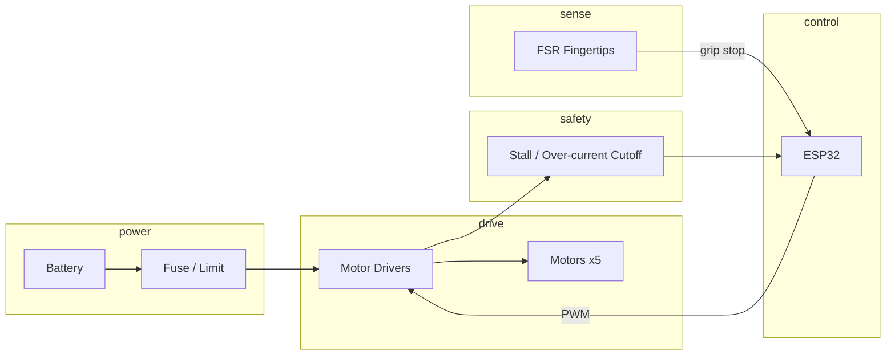

# YOKO — 3D-Printed Robotic Hand

**University student project** — A CAD-designed, 3D-printed five-finger robotic hand with multi-joint fingers and swappable parts. Built as a portfolio piece for internship and embedded/mechatronics coursework. ESP32 drives DC gear motors via PWM motor drivers; firmware includes calibration/homing limits, over-current stall cutoff, and FSR fingertip sensing for closed-loop grip-stop behavior.

> **Project context:** Capstone-style personal project demonstrating mechanical design (CAD, 3D print, tolerances), embedded systems (ESP32, PWM, ADC), and systems integration. Suitable for internship portfolios and technical interviews.


CAD screenshots   
| View 1 | View 2 |
|--------|--------|
|  |  |

*Homemade: desk prototype, layer lines, wires;. See [docs/images/](docs/images/) for files.*

---

## What I Built

### Mechanical
- 3D-printed hand: 5 fingers, multi-joint articulation, modular swappable parts
- CAD-designed; iterations on finger joints and tolerances to reduce binding and backlash
- Focus on tolerance tuning, linkage/joint iteration, and repeatability

### Electrical
- ESP32 as main controller
- DC gear motors driven via motor drivers (PWM)
- Calibration and homing limits; over-current / stall cutoff
- Fingertip FSR sensing for grip-stop behavior
- Current draw measured; peak wattage estimated (exact verification pending)

### Firmware
- PWM control for per-finger motor channels
- Calibration and homing routines with travel limits
- Safety: over-current detection and stall cutoff
- Debug workflow: serial logging and test markers for validation

### Learning outcomes (portfolio / internship)
- End-to-end build: CAD → STL → print → wiring → firmware → validation
- Parts selection and compatibility (ESP32, motor drivers, FSR, power); see [Build process & materials](#build-process--materials)
- Documented test procedures and logs for reproducible results

---

## Build process & materials

A **single verified stack** keeps the build efficient and parts compatible:

| Layer | Role | Compatible choices |
|-------|------|--------------------|
| MCU | Logic, PWM, ADC | ESP32 (3.3 V logic; 5 V tolerant inputs) |
| Motor driver | PWM in, motor power out | TB6612FNG, DRV8833, or L298 (logic 2.7–5.5 V; motor 4.5–12 V) |
| Motors | One per finger | 6 V or 12 V DC gear motors; match driver current (e.g. &lt; 1.2 A per channel for TB6612) |
| Sensors | Fingertip force | FSR (e.g. Interlink FSR-402) with 3.3 V and 10 kΩ divider → ESP32 ADC |
| Power | Supply | Single battery (6–12 V per driver spec); fuse recommended |

**Full build steps and BOM:** [BUILD.md](BUILD.md) · **Why these parts work together:** [docs/parts_compatibility.md](docs/parts_compatibility.md)

---

## System Diagram



**ASCII alternative:**

```
  [Battery] --> [Fuse] --> [Motor Drivers] --> [Motors x5]
       ^                      ^                    ^
       |                      |                    |
  [ESP32] ------------ PWM ---+                    |
       ^                      |                    |
       |                      +-- [Stall Cutoff] --+
       |
  [FSR Fingertips] --> grip-stop
```

---

## Firmware Highlights

- **PWM control:** Per-finger channels, rate limiting
- **Calibration / homing:** Travel limits, nonvolatile save (NVS; see firmware config)
- **Safety cutoff:** Over-current detection, stall cutoff (~1.5 A [PROVISIONAL])
- **Debug workflow:** Serial logs, test markers for `/logs` correlation

---

## Mechanical Highlights

- Tolerance tuning to reduce binding and backlash
- Linkage and joint iteration for smooth motion
- Modular, swappable parts for quick iteration and repair

---

## Testing & Validation

Procedures tracked in `/logs` and `/docs/testing_validation.md`. Metrics below are placeholders until verified; **replace with real measurements; see `/logs`.**

| Metric | Value | Status |
|--------|--------|--------|
| No-load current per motor | ~0.3 A | [PROVISIONAL] |
| Peak-load current per motor | ~1.4 A | [PROVISIONAL] |
| Stall/over-current cutoff threshold | ~1.5 A | [PROVISIONAL] |
| Full-hand peak power | ~45 W | [PROVISIONAL] |
| Payload tested | ~580 g | [PROVISIONAL] |
| Grasp success | 18/20 trials | [PROVISIONAL] |
| Open/close cycle time | ~1.6 s | [PROVISIONAL] |

Replace with verified measurements; see [Engineering Artifacts](#engineering-artifacts) and `/logs`.

---

## Engineering Artifacts

- **[BUILD.md](BUILD.md)** — Build order and materials (single verified stack; efficient path)
- **[/docs](docs/)** — Architecture, wiring, testing, BOM, **parts compatibility**
- **[/logs](logs/)** — Test log template, smoke test example, baseline metrics (sample/provisional)
- **[/artifacts](artifacts/)** — Diagrams, notes, and test procedures (ASCII/Mermaid; no photo dependency)
  - **[/artifacts/diagrams](artifacts/diagrams)** — System block, finger linkage, power/wiring, homing state machine, FSR grip-stop flow, PWM control
  - **[/artifacts/notes](artifacts/notes)** — Design iterations, debugging workflow, calibration, safety cutoff, mechanical tolerances
  - **[/artifacts/tests](artifacts/tests)** — Smoke test checklist, current-draw procedure, grasp trial procedure, stall/recovery procedure, regression checklist

---

## Repo Tour

| Path | Contents |
|------|----------|
| **BUILD.md** | Build order, BOM summary, and cross-refs (start here for a full build) |
| `docs/` | Architecture, wiring, testing, BOM template, **parts_compatibility.md** |
| `firmware/` | ESP32 code: `src/`, `include/`, `docs/` (build, serial, modules) |
| `hardware/` | `cad/`, `stl/` (print settings), `wiring/` (pinout, checklist) |
| `logs/` | Test log template and example/sample logs |
| `artifacts/diagrams/` | System, finger, power, homing, grip-stop, PWM (Mermaid + ASCII) |
| `artifacts/notes/` | Design, debugging, calibration, safety, tolerances |
| `artifacts/tests/` | Smoke, current draw, grasp, stall/recovery, regression procedures |

---

## How to Reproduce

**Efficient path:** Follow [BUILD.md](BUILD.md) (order: BOM → print → wiring → flash → test).

- **Print:** [hardware/stl/README.md](hardware/stl/README.md) — 0.2 mm layer, 20% infill, PLA/PETG.
- **Wiring:** [docs/wiring_notes.md](docs/wiring_notes.md) and [hardware/wiring/](hardware/wiring/) (pinout: [hardware/wiring/pinout.md](hardware/wiring/pinout.md)).
- **Firmware:** [firmware/README.md](firmware/README.md) and [firmware/docs/build.md](firmware/docs/build.md) — PlatformIO, ESP-IDF, or Arduino IDE with ESP32.

---

## Future Work

- Torque margin and better end-stops
- Sensor calibration and sealed wiring
- Optional: ROS2 integration

---

## Contact

- **GitHub:** [Seaphant](https://github.com/Seaphant)
- **LinkedIn:** [William Nguyen](https://www.linkedin.com/in/william-nguyen-6046633aa/)
