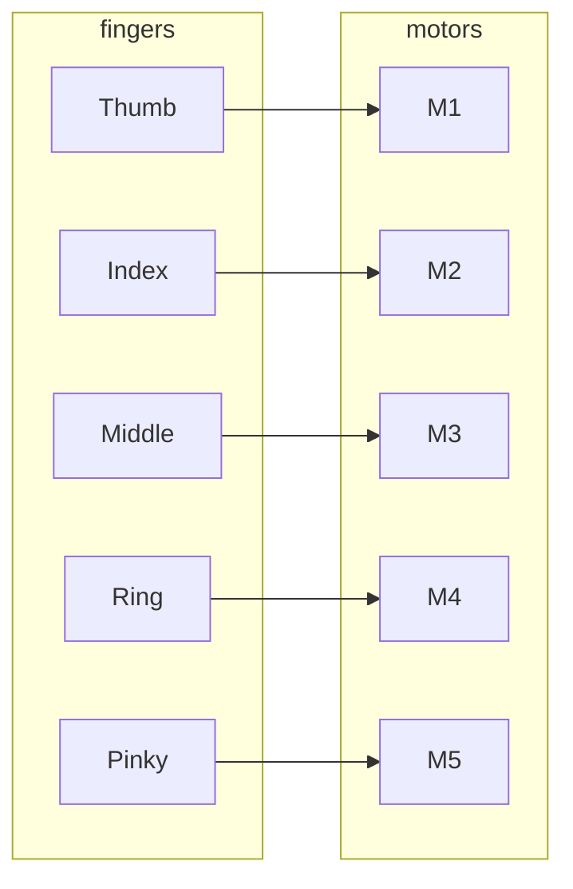

# YOKO — Finger Linkage / Joint Concept

Conceptual layout of one finger: multi-joint, linkage, and motor attachment. Used for tolerance and binding iteration.

---

## ASCII — Single Finger (Side View)

```
                    [Motor]
                        |
                        | (shaft / linkage)
                        v
    +-------+     +-------+     +-------+
    | Phalanx|-----| Joint |-----| Phalanx|  ... (multi-joint)
    |  (prox) |     |       |     | (dist) |
    +-------+     +-------+     +-------+
                        |
                   [FSR at tip]
```

---

## ASCII — Joint Detail (Tolerance / Binding Focus)

```
         linkage in
            |
    +-------v-------+
    |   Bearing /   |   ← clearance [TBD]; tune to reduce binding
    |   Pin / Boss  |   ← backlash reduced by iteration
    +-------^-------+
            |
         linkage out
```

---

## Mermaid — Finger Channels (5 Fingers)



---

*Evidence: mechanical structure concept. Swappable parts allow per-finger iteration. No fabricated dimensions.*
