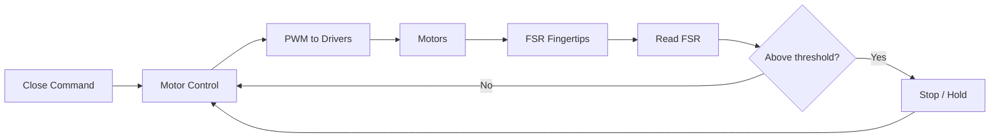

# YOKO — FSR Grip-Stop Closed-Loop Flow

Closed-loop behavior: FSR fingertip sensing triggers grip stop when contact/threshold is reached.

---

## Mermaid — Data Flow



---

## ASCII — Sequence

```
  User: "Close hand"
       |
       v
  Motor control: drive fingers closed
       |
       v
  FSR read (per finger or combined)
       |
       v
  Threshold reached? ----No----> keep driving (rate limit)
       |
      Yes
       |
       v
  Stop PWM / hold position
       |
       v
  (Optional: slight release or maintain grip)
```

---

## Notes

- Threshold 512 (0–1023) in firmware config; FSR used for grip-stop behavior only (confirmed).
- Optional expansion: per-finger pressure, slip detection.
