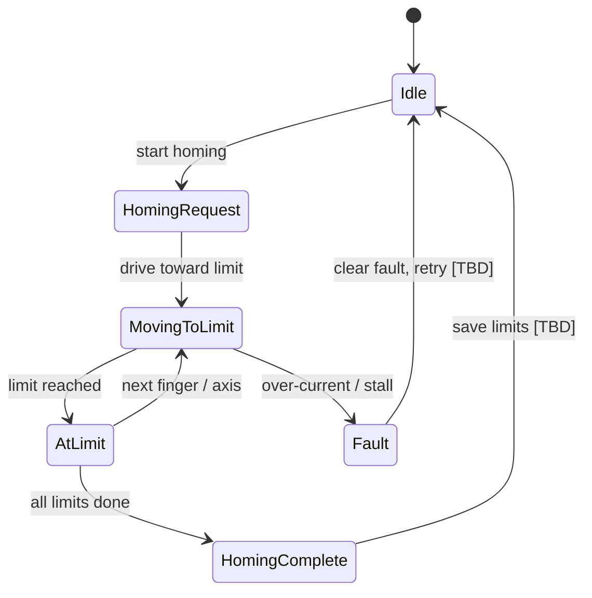

# YOKO — Homing / Calibration State Flow

State flow for homing routine: travel limits, direction, and completion. Used to validate calibration behavior.

---

## Mermaid — State Machine



---

## ASCII — Sequence

```
  START
    |
    v
  [Idle] ---(start)---> [Drive toward limit]
                              |
                              v
                        [Limit reached?] ---No---> (keep driving)
                              |
                             Yes
                              v
                        [More fingers?] ---Yes---> [Drive toward limit]
                              |
                             No
                              v
                        [Homing complete] ---> [Idle]

  (Any state) ---(over-current)---> [Fault] ---> [Idle after clear]
```

---

*Evidence: homing logic flow. Limits respected; stall/over-current triggers fault path. See logs for test results.*
