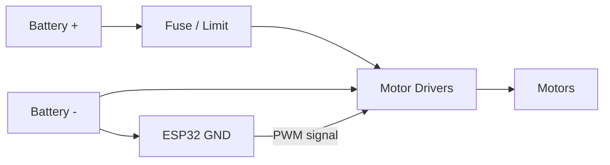

# YOKO — Power and Wiring Path

Power flow from battery to drivers and motors. Ground and signal paths kept clear for debugging.

---

## Mermaid — Power Path



---

## ASCII — Simplified Wiring

```
  BAT+ ----[FUSE]----+---- Driver 1 ---- Motor 1
                     +---- Driver 2 ---- Motor 2
                     +---- Driver 3 ---- Motor 3
                     +---- Driver 4 ---- Motor 4
                     +---- Driver 5 ---- Motor 5

  BAT- --------------+---- (common GND) ---- ESP32 GND

  ESP32 GPIO (PWM) ----> Driver 1 .. 5 (control)
```

---

## Notes

- Strain relief at connectors and flex points (see `docs/wiring_notes.md`).
- Current measurement: inline meter or shunt for no-load vs peak vs stall tests (see artifacts/tests/current_draw_procedure.md).
- No specific part numbers; diagram is structural only.
