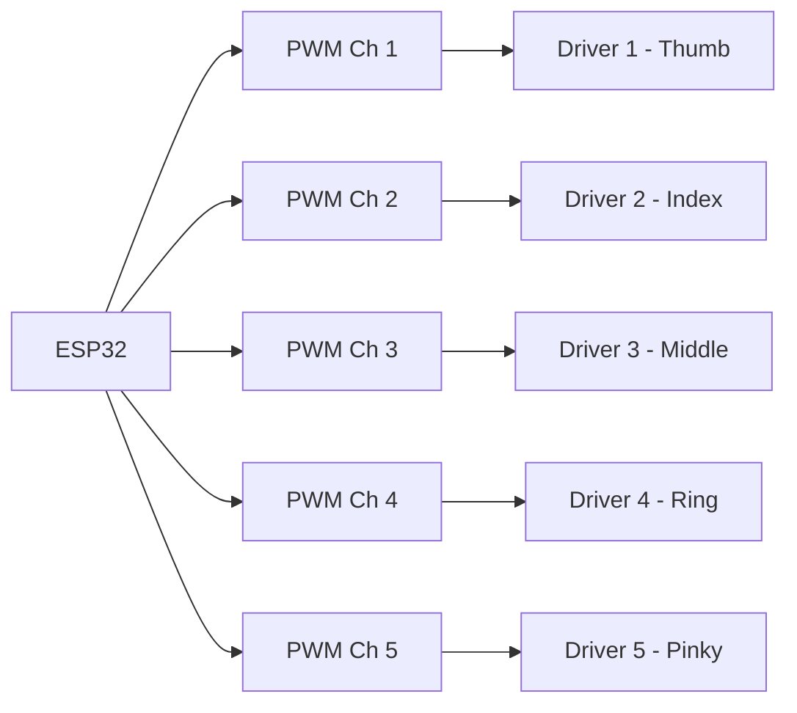

# YOKO — PWM Control (Concept)

Per-finger PWM to motor drivers; rate limiting applied to avoid sudden load spikes.

---

## ASCII — PWM Concept (One Channel)

```
  Duty cycle 0% -------- 100%
       |                    |
  Full reverse    Neutral   Full forward
       |            |            |
  <----+------------+------------+---->
       ^            ^            ^
     (direction + magnitude; driver-dependent)
```

---

## Mermaid — Multi-Channel Assignment



---

## Rate Limiting (Concept)

```
  Command: step target duty
       |
       v
  Current duty +/- max delta per cycle
       |
       v
  Output PWM (smoother motion; less peak current)
```

---

*Evidence: PWM and channel layout. 1 kHz, 8-bit in config.h; see firmware.*
