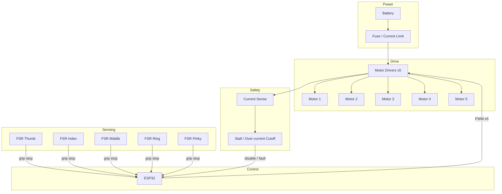

# YOKO — System Block Diagram

High-level block diagram: power path, control, drive, sensing, and safety.

---

## Mermaid



---

## ASCII

```
                    +----------+
                    | Battery  |
                    +----+-----+
                         |
                    +----v-----+
                    | Fuse /  |
                    | Limit   |
                    +----+-----+
                         |
    +--------+      +----v-----+      +-------------+
    | ESP32  | PWM  |  Motor   |      | Motors x5   |
    |        +------> Drivers +------> (per finger) |
    |        |      +----+-----+      +-------------+
    |        |           |
    |        |      +----v-----+
    |        +<-----+ Current  |
    |   fault|      | Sense /  |
    |        |      | Cutoff   |
    |        |      +----------+
    |        |
    |   +----v----+
    +<--+ FSR x5  |  (fingertips → grip stop)
        +---------+
```

---

*Evidence artifact: system-level blocks only. No fabricated specs.*
