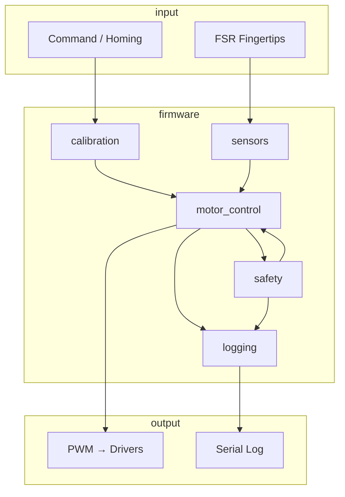

# YOKO — Firmware Architecture

Conceptual modules for the robotic hand control system.

---

## Modules

### motor_control
- PWM interfaces to motor drivers
- Per-finger channels and rate limiting
- Drives DC gear motors via motor driver boards

### calibration
- Homing routine and travel limits
- Nonvolatile save of limits (NVS; see firmware config.h)
- Used at startup and after mechanical changes

### safety
- Over-current detection and stall cutoff
- Stall cutoff threshold: ~1.5 A [PROVISIONAL]
- Thermal cooldown (optional; not yet implemented)
- Isolates moving parts; disconnect power before mechanical work

### sensors
- FSR fingertips for closed-loop grip stop
- Optional expansion (e.g., position, temperature) for future use

### logging
- Serial debug output
- Test markers for correlation with `/logs` entries

---

## Control / Data Flow

---

## Notes

- All current/threshold values are [PROVISIONAL] until verified; see `/logs` and `docs/testing_validation.md`.
- Update pinout and config as your wiring and toolchain are finalized.
- **Parts compatibility:** See [parts_compatibility.md](parts_compatibility.md) for a verified MCU/driver/motor/FSR/power stack.
